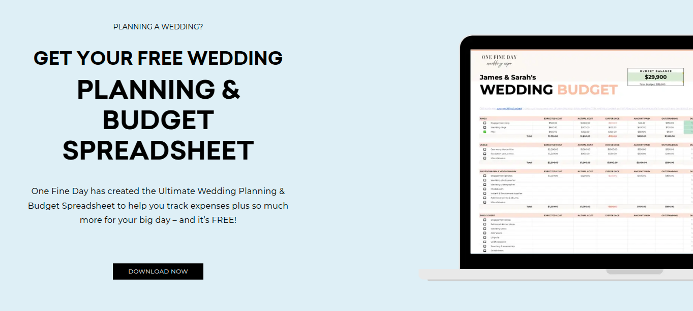

# Template Google Sheets Wedding Planner Gratis 
Template ini hadir untuk membantu Anda mewujudkan pernikahan impian tanpa repot.

## Langsung Unduh Sekarang

<a className="button button--primary" href="https://email.onefinedayweddingfair.com.au/p/7JLJ-8TR/wedding-planning-budget-spreadsheet" target="_blank" rel="noopener noreferrer">Unduh</a>

## Deskripsi

### Kelola Semua Aspek Pernikahan dalam Satu Tempat:

- Anggaran: Pantau pengeluaran dengan mudah dan atur alokasi dana untuk setiap kategori.
- Daftar Tamu: Kelola informasi tamu, RSVP, dan atur tempat duduk dengan praktis.
- Jadwal: Buat timeline lengkap dari persiapan hingga hari pernikahan.
- Vendor: Simpan informasi kontak vendor, bandingkan harga, dan lacak pembayaran.
- Tugas: Buat daftar tugas yang harus diselesaikan dan tandai saat selesai.
- Inspirasi: Kumpulkan ide-ide dekorasi, gaun, dan tema pernikahan dalam satu tempat.

### Fitur Unggulan:

- Gratis: Unduh dan gunakan template ini tanpa biaya.
- Mudah Digunakan: Desain intuitif dan mudah dipelajari, bahkan bagi pemula.
- Dapat Diakses Kapan Saja: Akses file Google Sheets dari perangkat apa pun dengan koneksi internet.
- Kolaborasi: Bagikan template dengan pasangan, keluarga, atau wedding organizer untuk perencanaan bersama.
- Fleksibel: Sesuaikan template sesuai kebutuhan dan preferensi Anda.

### Siapa yang Membutuhkan Template Ini?

- Calon pengantin yang ingin merencanakan pernikahan sendiri.
- Pasangan yang ingin mengatur anggaran pernikahan dengan cermat.
- Wedding organizer yang mencari alat bantu praktis.
- Jangan tunda lagi! Dapatkan template Google Sheets Wedding Planner gratis sekarang dan mulai rencanakan pernikahan impianmu!

Kata kunci: template google sheets wedding planner, wedding planner gratis, perencanaan pernikahan, anggaran pernikahan, daftar tamu, jadwal pernikahan, vendor pernikahan, tugas pernikahan, inspirasi pernikahan.